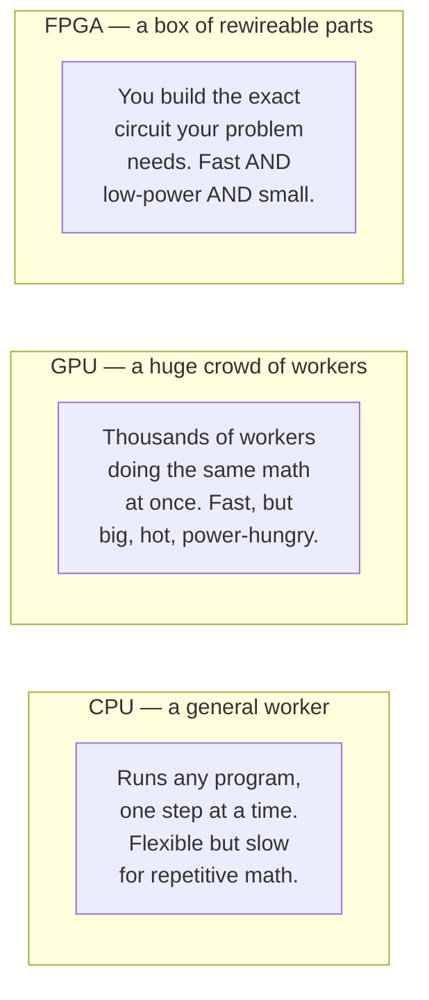
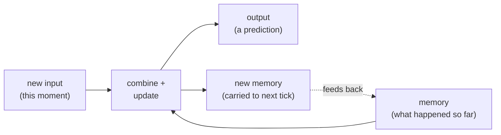
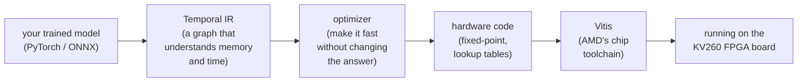
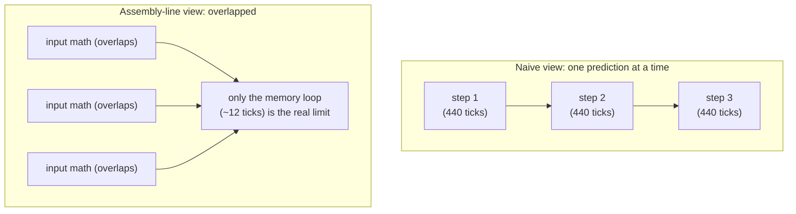
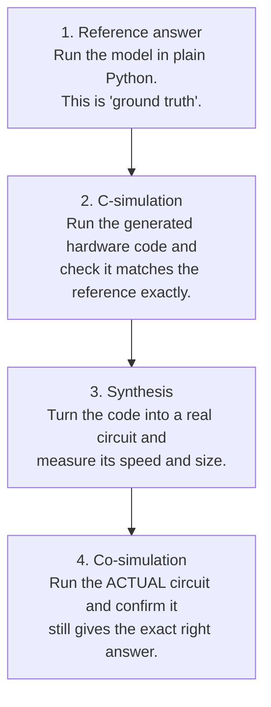

# TempoDAG explained, from scratch

*This explainer assumes you know a little bit of programming but **nothing**
about hardware, FPGAs, or how neural networks run on chips. If you've ever
wondered "how does an AI model actually run on a physical device, and why is
that hard?", this is for you. No prior knowledge required.*

---

## 1. The one-sentence version

**TempoDAG takes a trained time-series AI model and automatically turns it into
a custom circuit that runs on a special reprogrammable chip — making it
hundreds of times faster and far more power-efficient than running the same
model on a normal processor.**

Everything below unpacks that sentence.

---

## 2. The problem: writing AI is easy, *running* it cheaply is hard

Training an AI model on a big computer is a solved, everyday thing. The hard
part is *deploying* it — running it, over and over, quickly and cheaply, on a
small device that lives out in the world:

- a camera that has to react in real time,
- a medical sensor on your wrist that can't get hot or drain its battery,
- a trading system where being a microsecond late costs money.

These are called **edge** devices — the "edge" of the network, away from the
big data centre. On the edge you care about three things at once: **speed**
(answer now), **power** (don't drain the battery or overheat), and **cost**
(the chip has to be cheap).

A normal processor is bad at all three for this job. To see why, we need to
know what our options are.

---

## 3. Three kinds of chip (the only hardware background you need)

- A **CPU** (the processor in your laptop) is a general worker. It can run *any*
  program, but it does things mostly one step after another. Flexible, not fast
  for heavy repetitive math.

- A **GPU** (a graphics card) is a huge crowd of workers all doing the same
  calculation at once. Great for training AI, but physically large, and it
  draws a lot of power and produces a lot of heat. Not ideal on a wristband.

- An **FPGA** is the interesting one. Instead of running software, an FPGA is a
  chip full of tiny logic blocks and wires that **you can reconfigure into
  whatever circuit you want.** You're not writing a program that runs on a
  fixed processor — you're *building the processor itself*, shaped exactly to
  your problem. Because the circuit is custom, it can be fast, low-power, and
  small all at once.

The catch: designing that custom circuit is **hard and slow**. Traditionally an
engineer hand-crafts it over weeks. That's the pain TempoDAG removes — but
first, what kind of model are we putting on it?

---

## 4. What's a "time-series" model, and why is it special?

Most famous AI (image classifiers, chatbots) looks at one thing at a time. A
**time-series** model instead watches a *stream* of data that arrives over
time — a heartbeat, a stock price, a sensor reading — and it has a **memory**.

The classic example is an **RNN** (and its cousins the **GRU** and **LSTM**).
Picture it as a little machine that, at every tick of the clock, does this:

The important part is that dotted feedback arrow: **the memory feeds back into
itself.** Step 100 depends on the memory left by step 99, which depended on step
98, and so on. This "carrying memory forward" is exactly what makes time-series
models powerful — and, as we'll see, it's also the thing that makes them
tricky to speed up.

This whole style — a model that carries state and processes one item at a time
as it streams in — is called **streaming** or **stateful** inference.

---

## 5. What TempoDAG does

You hand TempoDAG a trained model (from PyTorch, TensorFlow, or the standard
ONNX format). It runs it through a pipeline and hands you back a verified
hardware design for the FPGA:

The two words in that picture that need explaining are **"Temporal IR"** and
**"fixed-point"**.

- **Temporal IR** is TempoDAG's internal representation of your model. "IR"
  means *intermediate representation* — a structured, machine-friendly form of
  the model that sits between "your PyTorch code" and "a circuit." The
  *temporal* part is the special sauce: unlike ordinary compilers, this IR
  understands memory and delay as first-class things. It knows which
  connections are "right now" and which ones are "remember this for the next
  tick." That knowledge is what lets it reason about speed correctly.

- **Fixed-point** is how we make the math cheap. Computers usually use
  *floating-point* numbers (like `3.14159265`) which are flexible but need big,
  power-hungry circuits. TempoDAG converts the model to **fixed-point** — think
  of it as using a fixed number of decimal places, like always working to the
  penny instead of to infinite precision. The circuits for that are tiny and
  fast. The risk is that rounding could wreck the model's accuracy — which is
  why we *prove* it doesn't (Section 8).

---

## 6. The key idea: why it comes out so fast

Here's the insight the whole project is built on, in an analogy.

One step of a GRU is a fair chunk of math — on our chip it takes about **440
clock ticks** from start to finish. The naive conclusion is: *one prediction =
440 ticks, so to go faster you must do less math.* **That's wrong**, and seeing
why is the "aha".

Think of a **car factory**. A car takes 8 hours to build from start to finish.
But the factory doesn't ship one car every 8 hours — it ships one every few
minutes, because there are dozens of cars on the assembly line at once, each at
a different station.

The same trick works here. Most of a GRU's math (crunching the new input) does
**not** depend on the previous prediction, so it can be "on the assembly line"
in parallel with other time-steps. Only the little **memory feedback loop** is a
true dependency — the one thing that genuinely has to wait for the previous
step.

So the real cost of one prediction isn't 440 ticks — it's the length of the
**memory loop**, about **12 ticks**. At the chip's clock speed that's **60
nanoseconds** (60 billionths of a second) per prediction. Engineers call this
"how often you can start a new prediction" the **initiation interval**, and
making it as small as physically possible is what the TempoDAG optimizer does.

*(If you want to see this proven — that overlapping gives the exact same answer,
down to the last bit — [walkthrough 2](../research/walkthrough/2_why_it_is_fast.py)
does it in a few lines of Python.)*

---

## 7. A bonus: it doesn't care how much history there is

There's a second advantage that falls out of "carrying memory forward."

A transformer (the architecture behind ChatGPT) has no running memory — to use
a long history, it has to **re-read the whole window every single time.** So if
you double the amount of history, you roughly double the work per prediction.

A streaming model carries its memory, so it does the **same tiny amount of work
per step regardless of how long the history is.** We call this
**window-independence**, and it's a structural win, not a tuning trick:

| history length | a window-based tool (hls4ml) | TempoDAG |
|---|---|---|
| 8 steps | 555 ns per prediction | **60 ns** |
| 32 steps | 2,115 ns | **60 ns** |
| 128 steps | 8,355 ns | **60 ns** |

The longer the memory your problem needs, the bigger TempoDAG's lead gets.

---

## 8. Why you can trust the numbers (this part matters)

It's easy to claim a big speed-up. The reason to believe this one is that every
design goes through a **verification ladder** before any number is reported —
four increasingly strict checks:

The last step is the strict one: it doesn't run the friendly source code, it
runs a simulation of the real gates-and-wires circuit, and checks the output is
*still* correct. Every architecture in this project passes it.

There's an extra subtlety this handles. When you round to fixed-point, the
answer changes a tiny bit. So "correct" can't mean "identical to the
floating-point model" — it means "identical to what the fixed-point math is
*supposed* to produce." TempoDAG generates its own fixed-point "answer key" and
checks the hardware against *that*, so the check is tight (a couple of rounding
units), not a loose fudge factor.

And the big worry — *does rounding to fixed-point ruin the model's accuracy?* —
is answered head-on in [walkthrough
1](../research/walkthrough/1_does_the_hardware_stay_accurate.py): a real GRU
trained on a chaotic forecasting benchmark keeps **99% of its accuracy** after
being squeezed into the chip's fixed-point format.

---

## 9. What we've actually got

Five different model types have been compiled and passed the full verification
ladder on the AMD KV260 board (in simulation):

| model | speed | plain-English size |
|---|---|---|
| RNN | 60 ns / prediction | small (uses ~23% of the chip) |
| GRU | 60 ns / prediction | medium (~70%) |
| LSTM | 60 ns / prediction | large (~92%) |
| diagonal-linear (a fast, simpler model) | 20 ns / prediction | tiny (~7%) |
| transformer block | 1.1 µs / token | medium (~20%) |

For comparison, the same GRU on a normal CPU takes about **77 microseconds** per
prediction — so the FPGA version is roughly **1,300× faster**, and about **35×
faster** than the best existing open FPGA tool (which also gets slower with
longer history, while ours doesn't).

---

## 10. What's still missing (the honest bit)

Everything above is **verified in simulation** — the industry-standard way to
prove a circuit is correct before committing it to silicon. What it is *not*
yet is **run on a physical board.**

The remaining step needs an actual AMD KV260 development board. With one, we
can:

- confirm the timing holds on real silicon (simulation proves the logic; only
  the real chip proves the final clock speed),
- measure real power draw and the performance-per-watt story that matters most
  for edge devices,
- run a trained model live on real streaming data,
- and put together a demo for the AMD Open Hardware competition.

In short: the hard, novel part — the compiler and its proof of correctness — is
done. A board is what turns *"proven in simulation"* into *"running in your
hand."*

---

## Where to go next

- See the numbers: [benchmarks](benchmarks.md)
- Read the three short walkthroughs: [research/walkthrough](../research/walkthrough/)
- Reproduce the benchmarks: [experiments/benchmark](../experiments/benchmark/)
